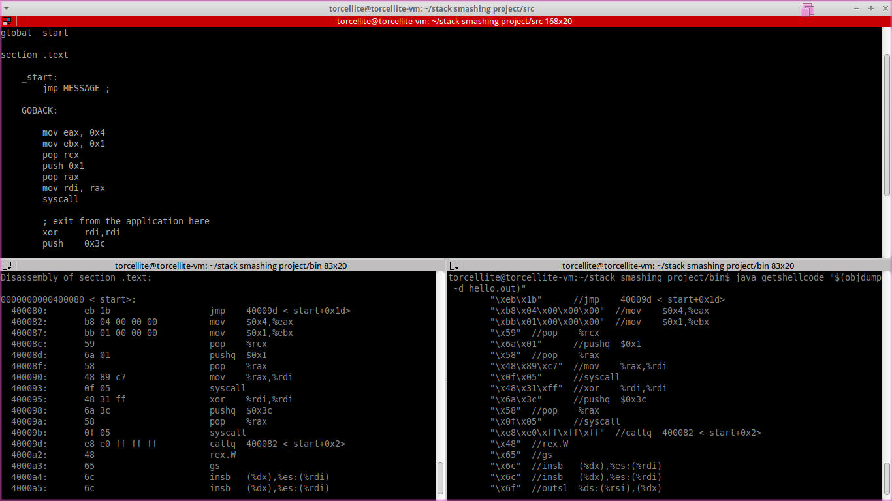

# Stack Smashing

Project under [Dr. Bhargav Bellur].

Project report (or if you just want to know more about the project) can be found at [torcellite.com].

To use the helper function "getshellcode.java" compile like a regular java program and feed the output of `objdump` as a command-line argument.

`javac getshellcode.java -d ../bin`

`cd bin`

`java getshellcode "$(objdump -d hello.out)"`

# Screenshot

[torcellite.com]:http://torcellite.com/projects/stack-smashing.html
[Dr. Bhargav Bellur]:http://pes.edu/faculty/bhargav-bellur
