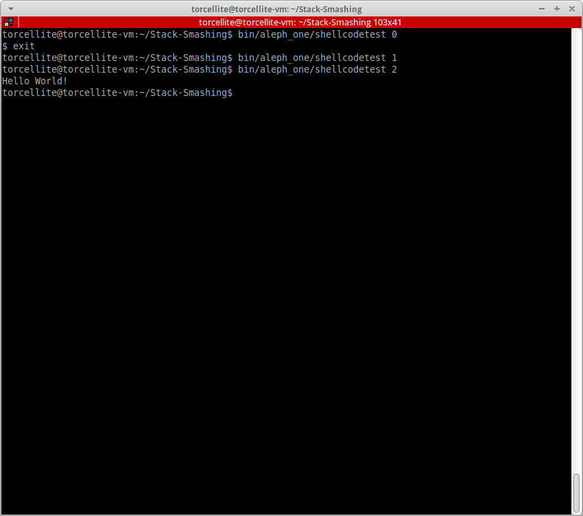
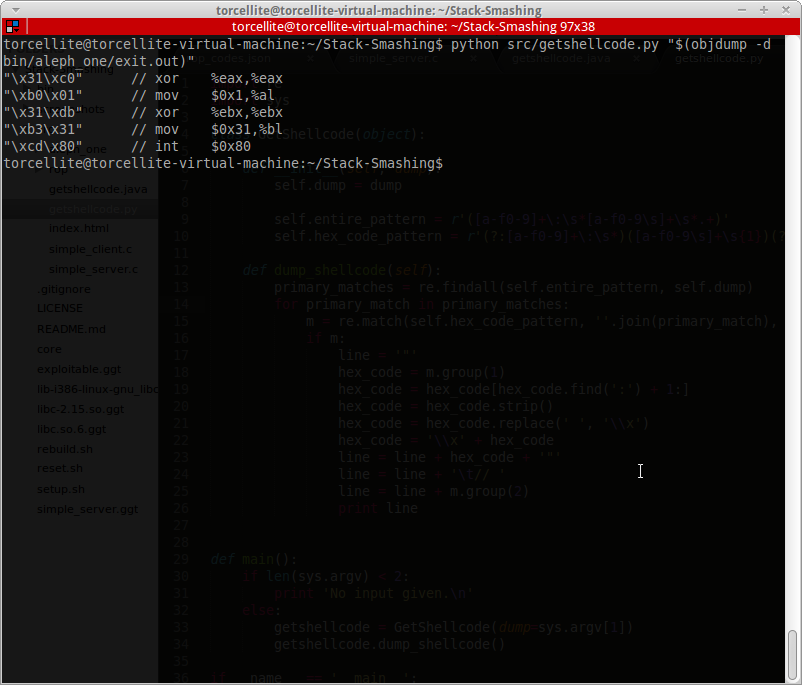
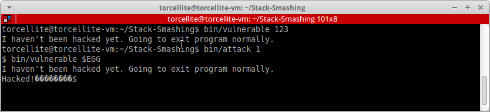

Stack Smashing
==============

Project under [Dr. Bhargav Bellur][1]. The project report can be found [here][2].

# Setup
1. Clone the repository into a folder of your choice.

2. Switch to the 32-bit branch if you're on a 32-bit system or just want to test it.

		git checkout 32-bit

3. Run the setup.sh file to create executable files in the `bin` folder

        cd Stack-Smashing # Or whichever folder you've cloned the project into
        ./setup.sh

4. Run any of the executables to examine the output. To run the test the shellcodes with all protections disabled run the `shellcodetest` executable.

        bin/shellcodetest

4. To create your own program to smash stacks, go through the example programs or check out the project report. You can use `getshellcode.java` to extract the hex values to be used as shellcode.

        cd bin
        java getshellcode "$(objdump -d shell.out)"

where `shell.out` is the executable for spawning a shell, created from `shell.asm`.

5. After you're done restore ASLR by executing `reset.sh`.

        ./reset.sh

6. If you've edited one or many files in the `src` folder and need to rebuild the executables, then run `rebuild.sh` instead of building executables manually or executing `setup.sh` again.

		./rebuild.sh

7. We have tried to follow the papers being demonstrated as closely as possible.
        
# Screenshot

[1]:http://pes.edu/faculty/bhargav-bellur
[2]:http://torcellite.com/projects/stack-smashing.html
